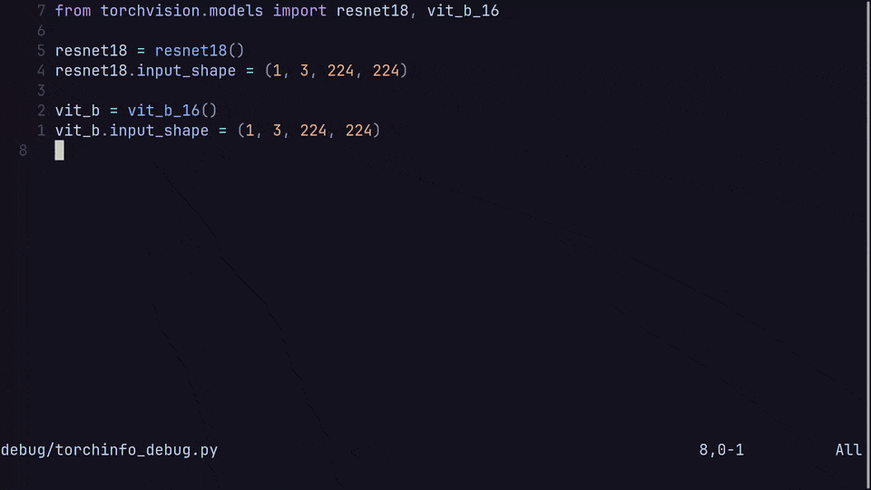

# torchinfo.nvim

Show information about Pytorch modules inside Neovim.



## Installation

Using lazy.nvim:

```lua
{ "alejandro-cobo/torchinfo.nvim", name = "torchinfo" }
```

In order for the plugin to work, the ```python``` command must point to a python
installation with all your required packages installed, including
[Pytorch](https://pytorch.org/).

If you are using a virtual environment (which is recommended), this means that
you must run ```source <venv/bin/activate>``` or similar before launching Neovim.

This plugin exports a function called ```get_info``` which accepts a python file
path as an argument. You can run this function inside Neovim. For example, to
pass the current file:

```
:lua require("torchinfo").get_info(vim.fn.expand("%"))
```

You can also define a keymap to make this process easier:

```lua
{
    "alejandro-cobo/torchinfo.nvim",
    name = "torchinfo",
    config = function()
        local torchinfo = require("torchinfo")
        -- Get info from current file
        vim.keymap.set("n", "<leader>ti", function()
            torchinfo.get_info(vim.fn.expand("%"))
        end)
    end
}
```

The ```setup``` method lets you configure the behavior of the plugin:

```lua
{
    "alejandro-cobo/torchinfo.nvim",
    name = "torchinfo",
    config = function()
        local torchinfo = require("torchinfo")
        torchinfo.setup({
            -- Focus the results window
            focus_win=true,
            -- Use the GPU with id 0
            gpu=0
        })
        -- Get info from current file
        vim.keymap.set("n", "<leader>ti", function()
            torchinfo.get_info(vim.fn.expand("%"))
        end)
    end
}
```

## Usage

See ```:h torchinfo.nvim```.

This plugin finds all the ```nn.Module``` classes in the source file and
computes the number of parameters and FLOPs for each one.

Classes that cannot be instantiated (e.g., because they have positional
arguments) will be ignored. You can either temporally give them default
values or create a global instance with some values.

For example, given the following python file:

```python
from torch import nn


class ModuleA(nn.Module):
    def __init__(self, in_dims, out_dims):
        super().__init__()
        self.fc = nn.Linear(in_dims, out_dims)

    def forward(self, x):
        return self.fc(x)


class ModuleB(nn.Module):
    def __init__(self, in_dims=100, out_dims=100):
        super().__init__()
        self.fc = nn.Linear(in_dims, out_dims)

    def forward(self, x):
        return self.fc(x)
```

ModuleA will be ignored while ModuleB will be successfully analyzed.

An example of global instances looks like this:

```python
from torch import nn


class MyModule(nn.Module):
    def __init__(self, in_dims, out_dims):
        super().__init__()
        self.fc = nn.Linear(in_dims, out_dims)

    def forward(self, x):
        return self.fc(x)


module_1 = MyModule(10, 10)
module_2 = MyModule(100, 100)
```

To compute the FLOPs of a model, it must have an attribute called
```input_shape```, which is a tuple containing the shape of the input
tensor:

```python
from torch import nn


class MyModule(nn.Module):
    def __init__(self, in_dims=100, out_dims=100):
        super().__init__()
        self.fc = nn.Linear(in_dims, out_dims)
        self.input_shape = (1, in_dims)

    def forward(self, x):
        return self.fc(x)
```

## Potential future features

- [x] Get a minimal version of the plugin working.
- [x] Explore other ways of showing information other than cmdline messages.
- [x] Use concurrency to run the script in background.
- [x] Output more info other than number of parameters, such as FLOPs.
- [ ] Support modules with non-standard inputs (multiple tensors, flags, etc.).
- [ ] Infer the input shape from the weights of the first layer in the
      ```forward``` method.
- [ ] Output a graph showing module connections.

