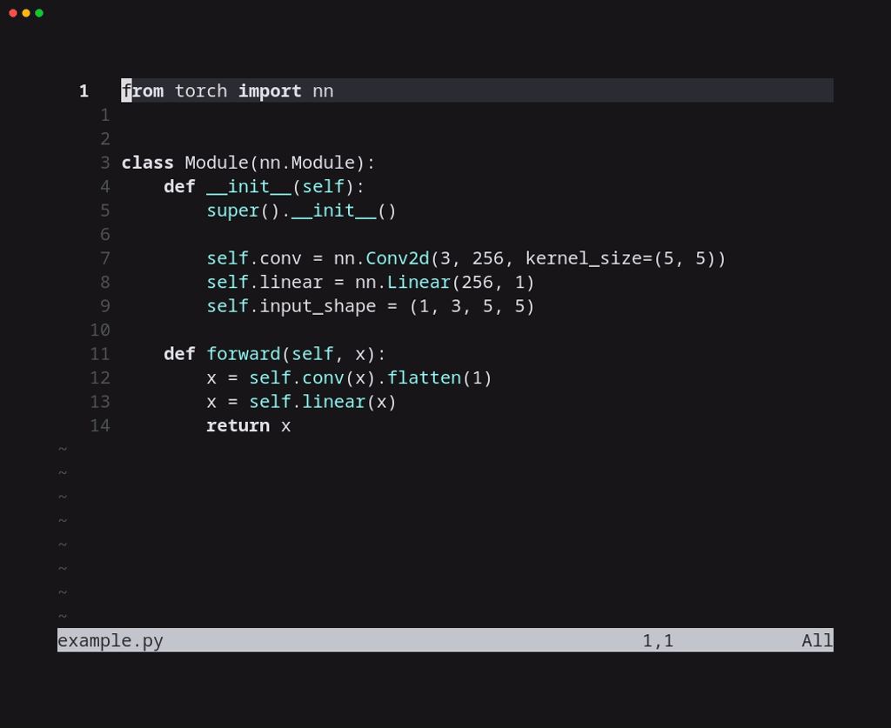

# torchinfo.nvim

Show information about Pytorch modules inside Neovim.



## Installation

Using lazy.nvim:

```lua
{
    "alejandro-cobo/torchinfo.nvim",
    name = "torchinfo",
    config = function()
        local torchinfo = require("torchinfo")
        torchinfo.setup({
            -- Focus the results window (press 'q' to close)
            focus_win = true,
            -- Use the GPU with id 0
            gpu = 0,
            -- Show info about children modules
            detailed = true
        })
        -- Get info from current file (only on python files)
        vim.api.nvim_create_autocmd("FileType", {
            pattern = "python",
            desc = "Run torchinfo.get_info() on current python file",
            callback = function()
                vim.keymap.set("n", "<leader>ti", function()
                    torchinfo.get_info(vim.fn.expand("%"))
                end, { buffer = true })
            end
        })
    end
}
```

## Usage

See `:h torchinfo.nvim`.

This plugin finds all the `nn.Module` classes in the source file and computes the number of parameters and FLOPs for each one.

Classes that cannot be instantiated (e.g., because they have positional arguments) will be ignored.
You can either temporally give them default values or create a global instance with some values.

For example, given the following python file:

```python
from torch import nn


class ModuleA(nn.Module):
    def __init__(self, in_dims, out_dims):
        super().__init__()
        self.fc = nn.Linear(in_dims, out_dims)

    def forward(self, x):
        return self.fc(x)


class ModuleB(nn.Module):
    def __init__(self, in_dims=100, out_dims=100):
        super().__init__()
        self.fc = nn.Linear(in_dims, out_dims)

    def forward(self, x):
        return self.fc(x)
```

ModuleA will be ignored while ModuleB will be successfully analyzed.

To compute the FLOPs of a model, it must have an attribute called `input_shape`, which is a tuple containing the shape of the input tensor:

```python
from torch import nn


class MyModule(nn.Module):
    def __init__(self, in_dims=100, out_dims=100):
        super().__init__()
        self.fc = nn.Linear(in_dims, out_dims)
        self.input_shape = (1, in_dims)

    def forward(self, x):
        return self.fc(x)
```
